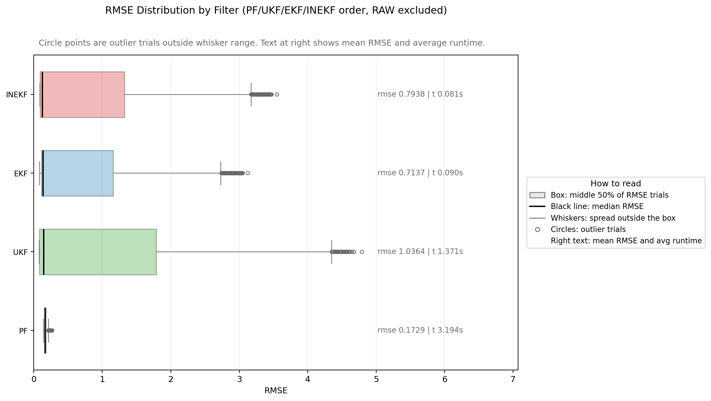
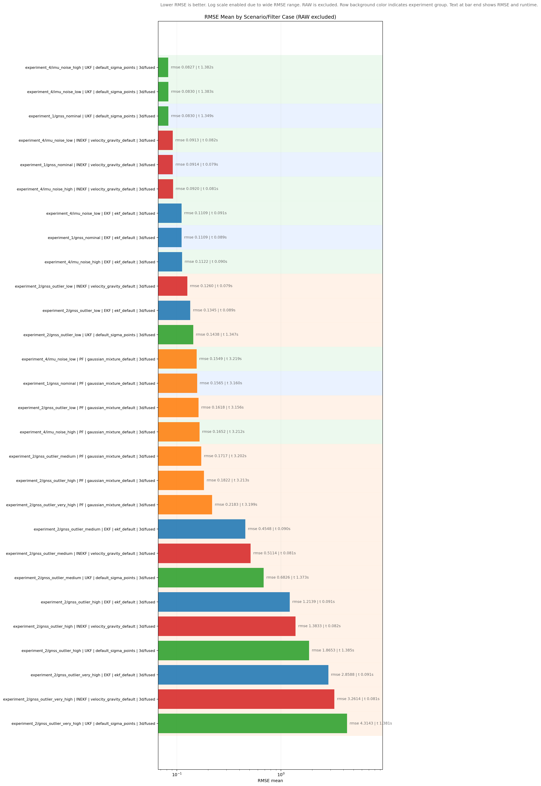
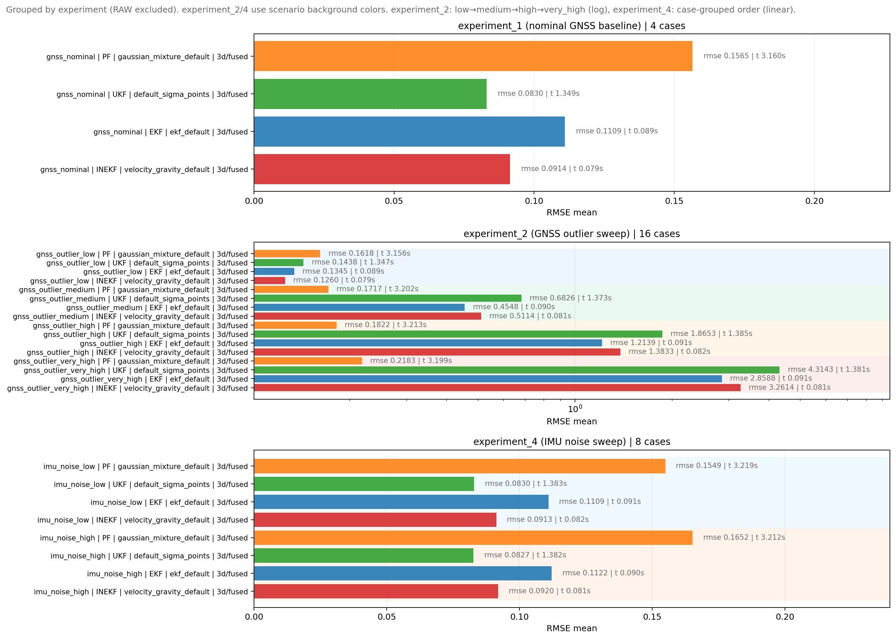
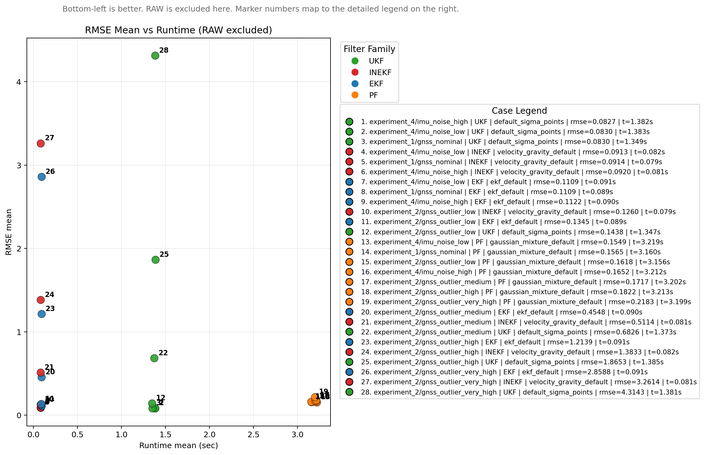

# IMU/GNSS State Estimation Benchmark Library

This repository is a Python benchmark library for IMU/GNSS state estimation.
It provides a unified pipeline for dataset preparation, filter execution, and trajectory/error visualization.

## Overview

Implemented filters:
- Extended Kalman Filter (EKF)
- Unscented Kalman Filter (UKF)
- Invariant Kalman Filter (InEKF)
- Particle Filter (PF)

Current state representations:
- `2d`: `[x, y, yaw]`
- `3d`: `[p(3), v(3), orientation(roll, pitch, yaw), IMU bias(ba(3), bg(3))]`

Supported dataset sources:
- `synthetic`
- `euroc`
- `rosbag`
- `m2dgr`

Note on `synthetic`:
- `synthetic` is generated data created by the repository itself
- controls are generated by the Python IMU generator in `utils/generate_imu.py`
- measurements are generated by the Python GNSS/GPS generator in `utils/generate_gnss.py`

## Implementation Notes

The filters are implemented with NumPy arrays and `numpy.linalg`; no external filtering library is required for execution.
All runners share the same dataset preparation, evaluation, and visualization flow so results can be compared under the same input conditions.

The current synthetic benchmark is intentionally simple: direct position GNSS with Gaussian or outlier-mixture noise.
PF is therefore not expected to dominate the clean Gaussian case; its advantage is expected to appear more clearly under non-Gaussian GNSS outliers.

## Reference Comparison

| Feature \ Reference | [navlie](https://github.com/decargroup/navlie) | [FilterPy](https://github.com/rlabbe/filterpy) | [Stone Soup](https://stonesoup.readthedocs.io/en/v1.2/auto_tutorials/index.html) | [robot_localization](https://github.com/cra-ros-pkg/robot_localization) | [DRIFT](https://github.com/UMich-CURLY/drift) | OURS |
| --- | --- | --- | --- | --- | --- | --- |
| **Python-based** | O | O | O | X | X | O |
| **EKF** | O | O | O | O | X | O |
| **UKF** | O | O | O | O | X | O |
| **PF** | X | O | O | X | X | O |
| **InEKF** | X | X | X | X | O | O |
| **Real-time estimation visualization** | X | X | X | X | X | O |
| **IMU model/input support** | O | X | X | O | O | O |
| **GPS processing/integration** | X | X | X | O | X | O |
| **IMU on/off** | X | X | X | X | X | O |
| **GPS on/off** | X | X | X | X | X | O |

## Installation

```bash
python3 -m venv .venv
source .venv/bin/activate
pip install -r requirements.txt
```

## Common Execution Flow

All filter runners follow the same flow:
1. Read `config/dataset_config.yaml` and the filter-specific config.
2. Load or generate controls, measurements, ground truth, and timestamps.
3. Save a unified dataset CSV.
4. Run the filter and save trajectory/error artifacts.

## How To Run Filters

All filter runners follow the same pattern:

```bash
cd /workspace/State_Estimation_Benchmark
python3 examples/run_<filter>.py
```

`<filter>` is the suffix used by the matching runner file under `examples/`.
To inspect raw inputs before filtering:

```bash
python3 examples/plot_dataset_before.py --source both
```

Dataset setup examples and dataset-specific notes were moved to [datasets/README.md](/workspace/State_Estimation_Benchmark/datasets/README.md).

## Synthetic Comparison Summary
All rows below use `synthetic_test`, `3d`, `1000` steps from the latest single-run logs in `examples/run_*.py`.
Cases are split by mode (`fused` vs `imu_only`) and GNSS noise setting (`outlier_mixture` vs `gaussian`).

| Mode | Noise | Filter | RMSE (position) | Runtime (filter only) | Note |
| --- | --- | --- | ---: | ---: | --- |
| `fused` | `outlier_mixture` | NoFilter | `0.9610` | `0.002 sec` | from `examples/run_noFilter.py` |
| `fused` | `outlier_mixture` | PF | `0.1707` | `3.125 sec` | from `examples/run_pf.py` |
| `fused` | `outlier_mixture` | UKF | `0.8977` | `1.375 sec` | from `examples/run_ukf.py` |
| `fused` | `outlier_mixture` | EKF | `0.5781` | `0.092 sec` | from `examples/run_ekf.py` |
| `fused` | `outlier_mixture` | InEKF | `0.6552` | `0.080 sec` | from `examples/run_inekf.py` |
| `fused` | `gaussian` | NoFilter | `0.0864` | `0.002 sec` | from `examples/run_noFilter.py` |
| `fused` | `gaussian` | PF | `0.1597` | `3.149 sec` | from `examples/run_pf.py` |
| `fused` | `gaussian` | UKF | `0.0825` | `1.351 sec` | from `examples/run_ukf.py` |
| `fused` | `gaussian` | EKF | `0.1153` | `0.088 sec` | from `examples/run_ekf.py` |
| `fused` | `gaussian` | InEKF | `0.0917` | `0.081 sec` | from `examples/run_inekf.py` |
| `imu_only` | `outlier_mixture` | NoFilter | `53.5276` | `0.002 sec` | from `examples/run_noFilter.py` |
| `imu_only` | `outlier_mixture` | PF | `53.9181` | `3.338 sec` | from `examples/run_pf.py` |
| `imu_only` | `outlier_mixture` | EKF | `23.9923` | `0.048 sec` | from `examples/run_ekf.py` |
| `imu_only` | `outlier_mixture` | InEKF | `53.5861` | `0.032 sec` | from `examples/run_inekf.py` |
| `imu_only` | `gaussian` | NoFilter | `53.5276` | `0.002 sec` | from `examples/run_noFilter.py` |
| `imu_only` | `gaussian` | PF | `53.9181` | `3.366 sec` | from `examples/run_pf.py` |
| `imu_only` | `gaussian` | UKF | `34.5726` | `0.949 sec` | from `examples/run_ukf.py` |
| `imu_only` | `gaussian` | EKF | `23.9923` | `0.049 sec` | from `examples/run_ekf.py` |
| `imu_only` | `gaussian` | InEKF | `53.5861` | `0.032 sec` | from `examples/run_inekf.py` |

Key takeaways from these runs: in `fused` mode with `outlier_mixture`, PF is best RMSE (`0.1707`) and clearly improves over NoFilter (`0.9610`); in `fused` mode with `gaussian`, UKF is best RMSE (`0.0825`) and close to NoFilter (`0.0864`). In `imu_only`, EKF is best among listed filters, but overall errors remain much larger than `fused`.

## Per-Filter Benchmark Update

The repository now includes `benchmarks/per_filter_benchmark.py` and `benchmarks/per_filter_benchmark.yaml` for repeated same-filter sweeps.
This benchmark fixes one filter family at a time, applies case-specific config overrides, changes the dataset seed across repeated trials, and writes both raw and aggregated CSV outputs under `outputs/benchmarks/per_filter/`.

Latest repeated-trial setup:
- datasets: `synthetic_2d_gaussian`, `synthetic_2d_outlier`, `synthetic_3d_gaussian`, `synthetic_3d_outlier`
- pose/mode: `2d` and `3d`, `fused`
- sequence length: `1000`
- trials: `100` per `(dataset case, filter case)` pair
- dataset seed range: `10..109`
- output files: `*_per_filter_raw.csv`, `*_per_filter_summary.csv`

### At A Glance

- 2D Gaussian best RMSE: `EKF ekf_default_config_noise` at `0.0304`
- 2D outlier best RMSE: `PF pf_10000_gmm_w010_n4` at `0.0442`
- 3D Gaussian best RMSE: `UKF ukf_high_alpha_beta0_kappa2` at `0.0572`
- 3D outlier best RMSE: `PF pf_20000_gmm_w005_n4` at `0.1651`
- Fastest 2D runtime: `EKF ekf_small_init_cov` at about `0.049 sec` per run

### Compact Comparison

| Dataset case | Best RMSE setting | RMSE mean | Fastest setting | Runtime mean |
| --- | --- | ---: | --- | ---: |
| `synthetic_2d_gaussian` | `ekf_default_config_noise` | `0.0304` | `ekf_small_init_cov` | `0.049 sec` |
| `synthetic_2d_outlier_mixture` | `pf_10000_gmm_w010_n4` | `0.0442` | `ekf_small_init_cov` | `0.049 sec` |
| `synthetic_3d_gaussian` | `ukf_high_alpha_beta0_kappa2` | `0.0572` | `inekf_default` | `0.080 sec` |
| `synthetic_3d_outlier_mixture` | `pf_20000_gmm_w005_n4` | `0.1651` | `inekf_default` | `0.080 sec` |

### Readout

- PF is strongest in outlier-heavy cases (`2d_outlier`, `3d_outlier`), while non-PF filters can win in cleaner settings.
- On `synthetic_2d_gaussian`, `ekf_default_config_noise` is the best non-PF and overall best RMSE (`0.0304`), with `ekf_small_init_cov` also the fastest (`0.049 sec`).
- On `synthetic_3d_gaussian`, tuned UKF sigma points (`ukf_high_alpha_beta0_kappa2`) produce the best RMSE (`0.0572`), while InEKF remains much faster (`0.080 sec`) than UKF/PF.
- In the current sweep, fastest runtime is consistently EKF in 2D and InEKF in 3D, while PF trades runtime for stronger robustness under GNSS outliers.


## Additional Benchmark Results

The table below reflects the latest `outputs/benchmarks/filter_benchmark_summary.csv` generated by `benchmarks/run_filter_benchmark.py`.
It is a repeated benchmark on `synthetic_test`, `3d`, `fused`, `1000` steps, and `100` trials per scenario case.

### Synthetic: `synthetic_test`

| Scenario case | Best RMSE (filter/case) | RMSE mean | Fastest runtime (filter/case) | Runtime mean |
| --- | --- | ---: | --- | ---: |
| `gnss_nominal` | `ukf/default_sigma_points` | `0.0830` | `inekf/velocity_gravity_default` | `0.079 sec` |
| `gnss_outlier_low` | `inekf/velocity_gravity_default` | `0.1260` | `inekf/velocity_gravity_default` | `0.079 sec` |
| `gnss_outlier_medium` | `pf/gaussian_mixture_default` | `0.1717` | `inekf/velocity_gravity_default` | `0.081 sec` |
| `gnss_outlier_high` | `pf/gaussian_mixture_default` | `0.1822` | `inekf/velocity_gravity_default` | `0.082 sec` |
| `gnss_outlier_very_high` | `pf/gaussian_mixture_default` | `0.2183` | `inekf/velocity_gravity_default` | `0.081 sec` |
| `imu_noise_low` | `ukf/default_sigma_points` | `0.0830` | `inekf/velocity_gravity_default` | `0.082 sec` |
| `imu_noise_high` | `ukf/default_sigma_points` | `0.0827` | `inekf/velocity_gravity_default` | `0.081 sec` |

Scenario-level takeaway: PF is best in medium/high outlier scenarios, UKF is best in nominal and IMU-noise scenarios, and InEKF is the fastest across all current scenario cases.

#### Benchmark Plots

`filter_benchmark_raw_boxplots.png`: trial-level RMSE/runtime spread for each filter and scenario.



`filter_benchmark_summary_bars.png`: mean RMSE and runtime bars grouped by scenario case.



`filter_benchmark_summary_bars_by_experiment.png`: summary bars reorganized by experiment families (`experiment_1/2/4`).



`filter_benchmark_summary_tradeoff.png`: accuracy-vs-runtime tradeoff view to compare fast/accurate settings.



A separate single-run PF sweep on `examples/run_pf.py` with the same `synthetic_test` dataset showed a clear speed/accuracy trade-off across particle counts:

| PF setting | RMSE (position) | Runtime (filter only) | Notes |
| --- | ---: | ---: | --- |
| `50` particles | `0.2528` | `0.033 sec` | fastest tested PF setting, but lowest accuracy in the sweep |
| `500` particles | `0.2504` | `0.059 sec` | modest runtime increase, little RMSE gain over `50` |
| `1000` particles | `0.2402` | `0.087 sec` | good practical baseline for speed-conscious runs |
| `3000` particles | `0.2398` | `0.195 sec` | slightly best RMSE among the completed Gaussian PF runs |
| `3000` particles + GMM likelihood | `0.2489` | `0.221 sec` | more expensive here, without a gain on this single run |
| `50000` particles | `0.2400` | `2.767 sec` | essentially no RMSE gain over `3000`, but a very large runtime cost |

PF sweep takeaway: on this synthetic setup, increasing particles beyond about `1000` to `3000` gives only a small RMSE improvement, while very large particle counts mainly increase runtime. In the reported single run, `3000` particles was the best completed accuracy point, and `1000` particles looked like the best speed/accuracy compromise.

### M2DGR: `street_01`

| Filter | RMSE (position) | Runtime (filter only) | Status |
| --- | ---: | ---: | --- |
| PF | `0.9286` | `25.943 sec` | measured |
| EKF | `0.0228` | `2.293 sec` | measured |
| UKF | `0.0228` | `23.835 sec` | measured |
| InEKF | `TBD` | `TBD` | not recorded yet |

### EuRoC: `V1_01_easy(vicon_room1)`

| Filter | RMSE (position) | Runtime (filter only) | Status |
| --- | ---: | ---: | --- |
| PF | `0.3218` | `8.563 sec` | measured |
| EKF | `0.3212` | `1.675 sec` | measured |
| UKF | `0.3212` | `12.256 sec` | measured |
| InEKF | `TBD` | `TBD` | not recorded yet |

These tables compare filters on a fixed dataset for each benchmark sequence.

## Docker Usage

Build the image:

```bash
docker build -t state-estimation-benchmark:latest .
```

## References

The implementation is inspired by existing libraries and tutorials:
- [navlie](https://github.com/decargroup/navlie)
- [FilterPy](https://github.com/rlabbe/filterpy)
- [Stone Soup tutorials](https://stonesoup.readthedocs.io/en/v1.2/auto_tutorials/index.html)
- [robot_localization](https://github.com/cra-ros-pkg/robot_localization)
- [DRIFT](https://github.com/UMich-CURLY/drift)
- Roger Labbe, *Kalman and Bayesian Filters in Python*, Chapter 12 Particle Filters
